# Pattern 2: Complete Architecture Documentation

## Overview

Pattern 2 implements an intelligent document processing workflow using Amazon Textract for OCR and Amazon Bedrock with Claude models for classification and extraction. This document covers the complete architecture including the UI/UX layer.

## Table of Contents

- [High-Level Architecture](#high-level-architecture)
- [Data Flow](#data-flow)
- [Component Details](#component-details)
- [UI/UX Layer Architecture](#uiux-layer-architecture)
- [Processing Pipeline](#processing-pipeline)
- [Security Architecture](#security-architecture)
- [Monitoring and Observability](#monitoring-and-observability)
- [Deployment Options](#deployment-options)

## High-Level Architecture

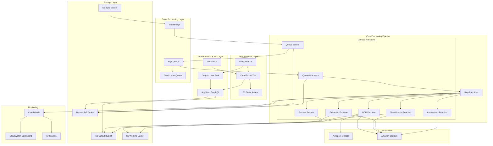
```mermaid
graph TB
    subgraph "User Interface Layer"
        UI[React Web UI]
        CF[CloudFront CDN]
        S3UI[S3 Static Assets]
    end
    
    subgraph "Authentication & API Layer"
        COG[Cognito User Pool]
        APIS[AppSync GraphQL]
        WAF[AWS WAF]
    end
    
    subgraph "Event Processing Layer"
        EB[EventBridge]
        SQS[SQS Queue]
        DLQ[Dead Letter Queue]
    end
    
    subgraph "Core Processing Pipeline"
        SF[Step Functions]
        subgraph "Lambda Functions"
            QS[Queue Sender]
            QP[Queue Processor]
            OCR[OCR Function]
            CLS[Classification Function]
            EXT[Extraction Function]
            ASS[Assessment Function]
            PR[Process Results]
        end
    end
    
    subgraph "AI Services"
        TX[Amazon Textract]
        BR[Amazon Bedrock]
    end
    
    subgraph "Storage Layer"
        S3I[S3 Input Bucket]
        S3O[S3 Output Bucket]
        S3W[S3 Working Bucket]
        DDB[DynamoDB Tables]
    end
    
    subgraph "Monitoring"
        CW[CloudWatch]
        CWDB[CloudWatch Dashboard]
        SNS[SNS Alerts]
    end
    
    UI --> CF
    CF --> S3UI
    CF --> APIS
    WAF --> CF
    UI --> COG
    COG --> APIS
    
    APIS --> DDB
    APIS --> S3O
    
    S3I --> EB
    EB --> QS
    QS --> SQS
    SQS --> QP
    QP --> SF
    
    SF --> OCR
    SF --> CLS
    SF --> EXT
    SF --> ASS
    SF --> PR
    
    OCR --> TX
    OCR --> BR
    CLS --> BR
    EXT --> BR
    ASS --> BR
    
    OCR --> S3W
    CLS --> S3W
    EXT --> S3O
    PR --> S3O
    
    SF --> DDB
    QS --> DDB
    QP --> DDB
    
    SF --> CW
    CW --> CWDB
    CW --> SNS
    
    SQS --> DLQ
```

## Data Flow

### 1. Document Upload Flow

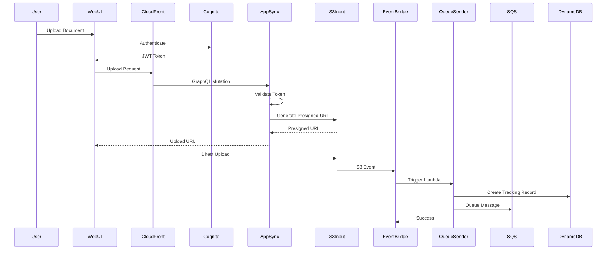
```mermaid
sequenceDiagram
    participant User
    participant WebUI
    participant CloudFront
    participant Cognito
    participant AppSync
    participant S3Input
    participant EventBridge
    participant QueueSender
    participant SQS
    participant DynamoDB
    
    User->>WebUI: Upload Document
    WebUI->>Cognito: Authenticate
    Cognito-->>WebUI: JWT Token
    WebUI->>CloudFront: Upload Request
    CloudFront->>AppSync: GraphQL Mutation
    AppSync->>AppSync: Validate Token
    AppSync->>S3Input: Generate Presigned URL
    S3Input-->>AppSync: Presigned URL
    AppSync-->>WebUI: Upload URL
    WebUI->>S3Input: Direct Upload
    S3Input->>EventBridge: S3 Event
    EventBridge->>QueueSender: Trigger Lambda
    QueueSender->>DynamoDB: Create Tracking Record
    QueueSender->>SQS: Queue Message
    QueueSender-->>EventBridge: Success
```

### 2. Document Processing Flow

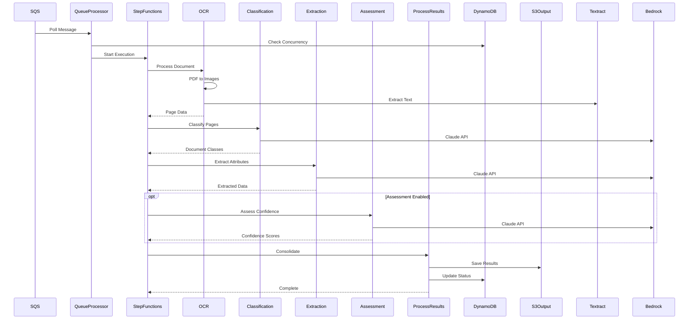
```mermaid
sequenceDiagram
    participant SQS
    participant QueueProcessor
    participant StepFunctions
    participant OCR
    participant Classification
    participant Extraction
    participant Assessment
    participant ProcessResults
    participant DynamoDB
    participant S3Output
    
    SQS->>QueueProcessor: Poll Message
    QueueProcessor->>DynamoDB: Check Concurrency
    QueueProcessor->>StepFunctions: Start Execution
    
    StepFunctions->>OCR: Process Document
    OCR->>OCR: PDF to Images
    OCR->>Textract: Extract Text
    OCR-->>StepFunctions: Page Data
    
    StepFunctions->>Classification: Classify Pages
    Classification->>Bedrock: Claude API
    Classification-->>StepFunctions: Document Classes
    
    StepFunctions->>Extraction: Extract Attributes
    Extraction->>Bedrock: Claude API
    Extraction-->>StepFunctions: Extracted Data
    
    opt Assessment Enabled
        StepFunctions->>Assessment: Assess Confidence
        Assessment->>Bedrock: Claude API
        Assessment-->>StepFunctions: Confidence Scores
    end
    
    StepFunctions->>ProcessResults: Consolidate
    ProcessResults->>S3Output: Save Results
    ProcessResults->>DynamoDB: Update Status
    ProcessResults-->>StepFunctions: Complete
```

## Component Details

### Core Processing Components

#### OCR Function
- **Runtime**: Python 3.12
- **Memory**: 4096 MB
- **Timeout**: 900 seconds
- **Capabilities**:
  - PDF to image conversion (configurable DPI)
  - Concurrent page processing (ThreadPoolExecutor)
  - Dual OCR backends (Textract or Bedrock)
  - Image preprocessing and optimization
  - Smart resizing with aspect ratio preservation

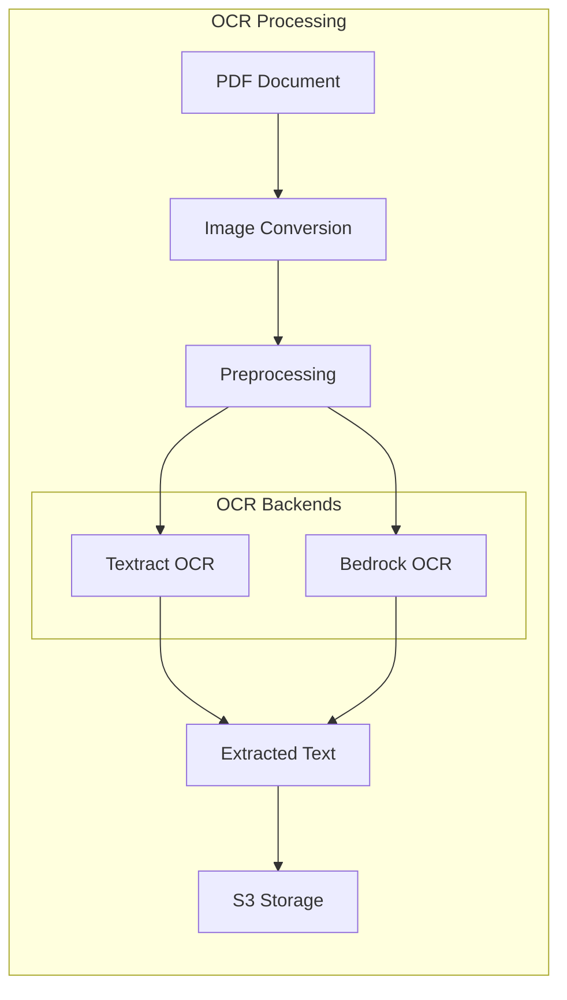
```mermaid
graph LR
    subgraph "OCR Processing"
        PDF[PDF Document]
        IMG[Image Conversion]
        PRE[Preprocessing]
        
        subgraph "OCR Backends"
            TX[Textract OCR]
            BR[Bedrock OCR]
        end
        
        TXT[Extracted Text]
        S3[S3 Storage]
    end
    
    PDF --> IMG
    IMG --> PRE
    PRE --> TX
    PRE --> BR
    TX --> TXT
    BR --> TXT
    TXT --> S3
```

#### Classification Function
- **Runtime**: Python 3.12
- **Memory**: 3008 MB
- **Timeout**: 600 seconds
- **Methods**:
  - Page-level classification (multimodal)
  - Holistic packet classification (text-based)
- **Features**:
  - Few-shot example support
  - Concurrent processing
  - RVL-CDIP category support

#### Extraction Function
- **Runtime**: Python 3.12
- **Memory**: 3008 MB
- **Timeout**: 600 seconds
- **Features**:
  - Class-specific attribute extraction
  - Configurable prompts
  - Few-shot examples
  - Token usage tracking

#### Assessment Function (Optional)
- **Runtime**: Python 3.12
- **Memory**: 3008 MB
- **Timeout**: 600 seconds
- **Features**:
  - Confidence scoring per attribute
  - Explanatory reasoning
  - Granular assessment for complex documents
  - HITL trigger thresholds

### State Machine Workflow

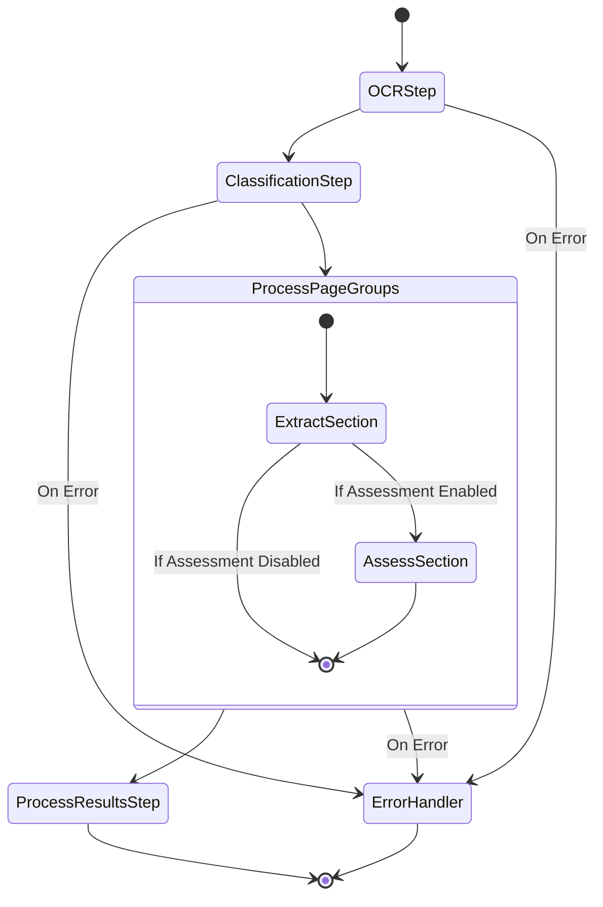
```mermaid
stateDiagram-v2
    [*] --> OCRStep
    OCRStep --> ClassificationStep
    ClassificationStep --> ProcessPageGroups
    
    state ProcessPageGroups {
        [*] --> ExtractSection
        ExtractSection --> AssessSection: If Assessment Enabled
        ExtractSection --> [*]: If Assessment Disabled
        AssessSection --> [*]
    }
    
    ProcessPageGroups --> ProcessResultsStep
    ProcessResultsStep --> [*]
    
    OCRStep --> ErrorHandler: On Error
    ClassificationStep --> ErrorHandler: On Error
    ProcessPageGroups --> ErrorHandler: On Error
    ErrorHandler --> [*]
```

## UI/UX Layer Architecture

### Frontend Architecture

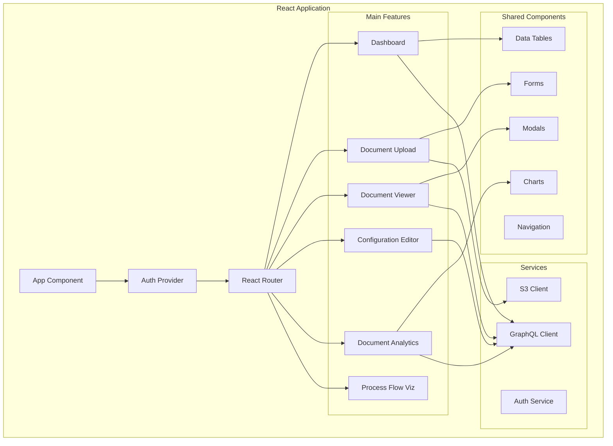
```mermaid
graph TB
    subgraph "React Application"
        APP[App Component]
        AUTH[Auth Provider]
        ROUTER[React Router]
        
        subgraph "Main Features"
            DASH[Dashboard]
            UP[Document Upload]
            VIEW[Document Viewer]
            CONFIG[Configuration Editor]
            ANALYTICS[Document Analytics]
            FLOW[Process Flow Viz]
        end
        
        subgraph "Shared Components"
            NAV[Navigation]
            TABLE[Data Tables]
            CHART[Charts]
            MODAL[Modals]
            FORM[Forms]
        end
        
        subgraph "Services"
            GQLC[GraphQL Client]
            S3C[S3 Client]
            AUTHC[Auth Service]
        end
    end
    
    APP --> AUTH
    AUTH --> ROUTER
    ROUTER --> DASH
    ROUTER --> UP
    ROUTER --> VIEW
    ROUTER --> CONFIG
    ROUTER --> ANALYTICS
    ROUTER --> FLOW
    
    DASH --> TABLE
    ANALYTICS --> CHART
    UP --> FORM
    VIEW --> MODAL
    
    DASH --> GQLC
    UP --> S3C
    VIEW --> GQLC
    CONFIG --> GQLC
    ANALYTICS --> GQLC
```

### GraphQL API Schema

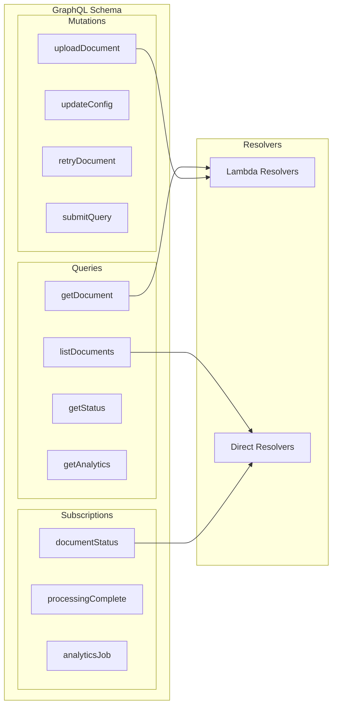
```mermaid
graph LR
    subgraph "GraphQL Schema"
        subgraph "Queries"
            GD[getDocument]
            LD[listDocuments]
            GS[getStatus]
            GA[getAnalytics]
        end
        
        subgraph "Mutations"
            UD[uploadDocument]
            UC[updateConfig]
            RD[retryDocument]
            SQ[submitQuery]
        end
        
        subgraph "Subscriptions"
            DS[documentStatus]
            PC[processingComplete]
            AJ[analyticsJob]
        end
    end
    
    subgraph "Resolvers"
        LR[Lambda Resolvers]
        DR[Direct Resolvers]
    end
    
    GD --> LR
    LD --> DR
    UD --> LR
    DS --> DR
```

### Authentication Flow

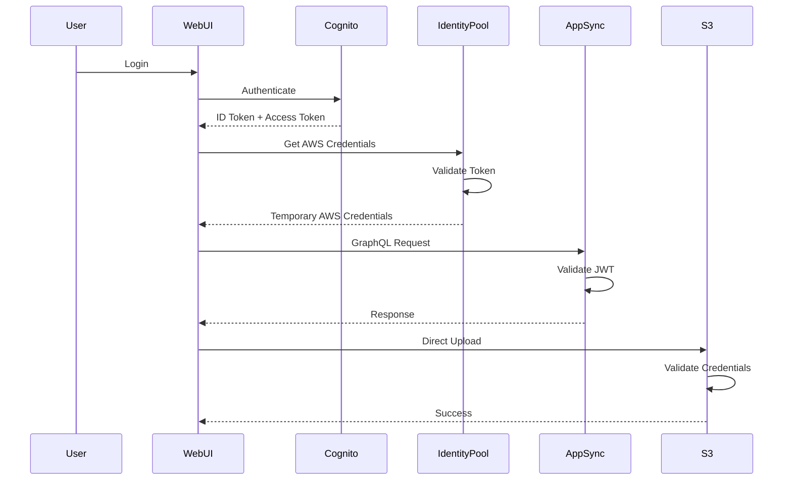
```mermaid
sequenceDiagram
    participant User
    participant WebUI
    participant Cognito
    participant IdentityPool
    participant AppSync
    participant S3
    
    User->>WebUI: Login
    WebUI->>Cognito: Authenticate
    Cognito-->>WebUI: ID Token + Access Token
    WebUI->>IdentityPool: Get AWS Credentials
    IdentityPool->>IdentityPool: Validate Token
    IdentityPool-->>WebUI: Temporary AWS Credentials
    
    WebUI->>AppSync: GraphQL Request
    AppSync->>AppSync: Validate JWT
    AppSync-->>WebUI: Response
    
    WebUI->>S3: Direct Upload
    S3->>S3: Validate Credentials
    S3-->>WebUI: Success
```

## Processing Pipeline

### OCR Backend Selection

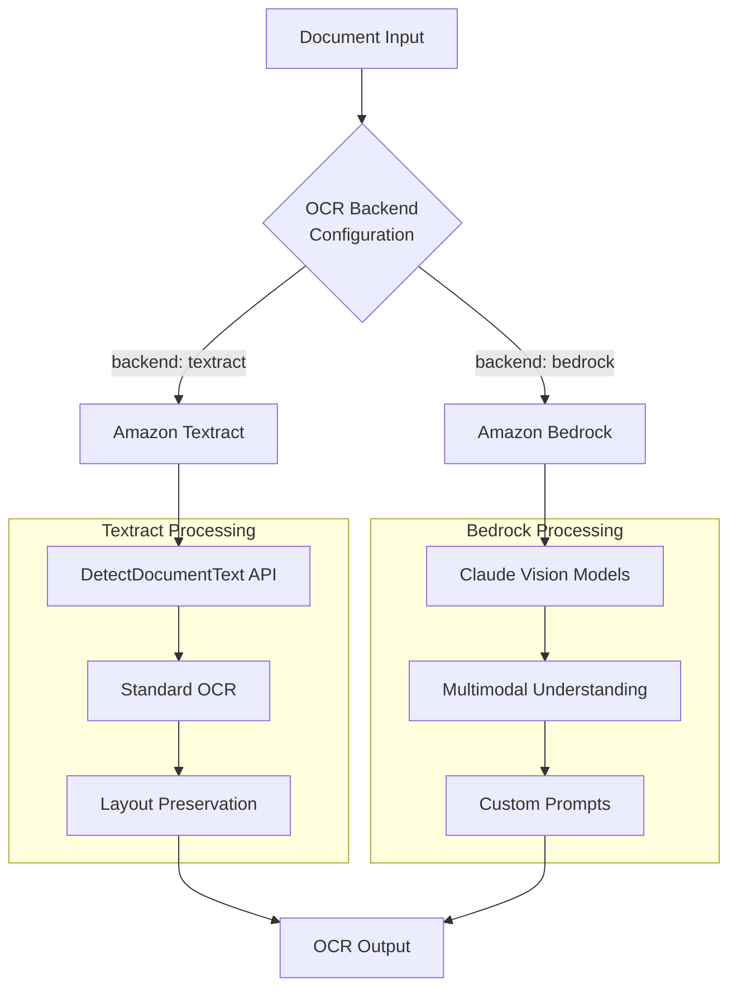
```mermaid
flowchart TD
    DOC[Document Input]
    CONFIG{OCR Backend<br/>Configuration}
    
    TEXTRACT[Amazon Textract]
    BEDROCK[Amazon Bedrock]
    
    subgraph "Textract Processing"
        T1[DetectDocumentText API]
        T2[Standard OCR]
        T3[Layout Preservation]
    end
    
    subgraph "Bedrock Processing"
        B1[Claude Vision Models]
        B2[Multimodal Understanding]
        B3[Custom Prompts]
    end
    
    RESULT[OCR Output]
    
    DOC --> CONFIG
    CONFIG -->|backend: textract| TEXTRACT
    CONFIG -->|backend: bedrock| BEDROCK
    
    TEXTRACT --> T1
    T1 --> T2
    T2 --> T3
    T3 --> RESULT
    
    BEDROCK --> B1
    B1 --> B2
    B2 --> B3
    B3 --> RESULT
```

### Classification Methods

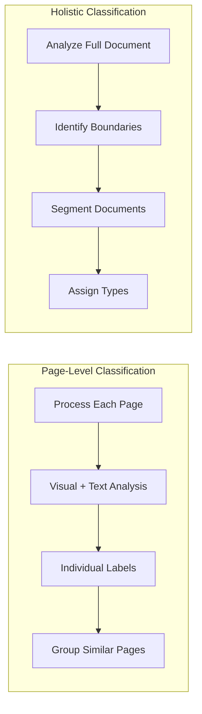
```mermaid
flowchart LR
    subgraph "Page-Level Classification"
        PL1[Process Each Page]
        PL2[Visual + Text Analysis]
        PL3[Individual Labels]
        PL4[Group Similar Pages]
    end
    
    subgraph "Holistic Classification"
        H1[Analyze Full Document]
        H2[Identify Boundaries]
        H3[Segment Documents]
        H4[Assign Types]
    end
    
    PL1 --> PL2
    PL2 --> PL3
    PL3 --> PL4
    
    H1 --> H2
    H2 --> H3
    H3 --> H4
```

## Security Architecture

### Network Security

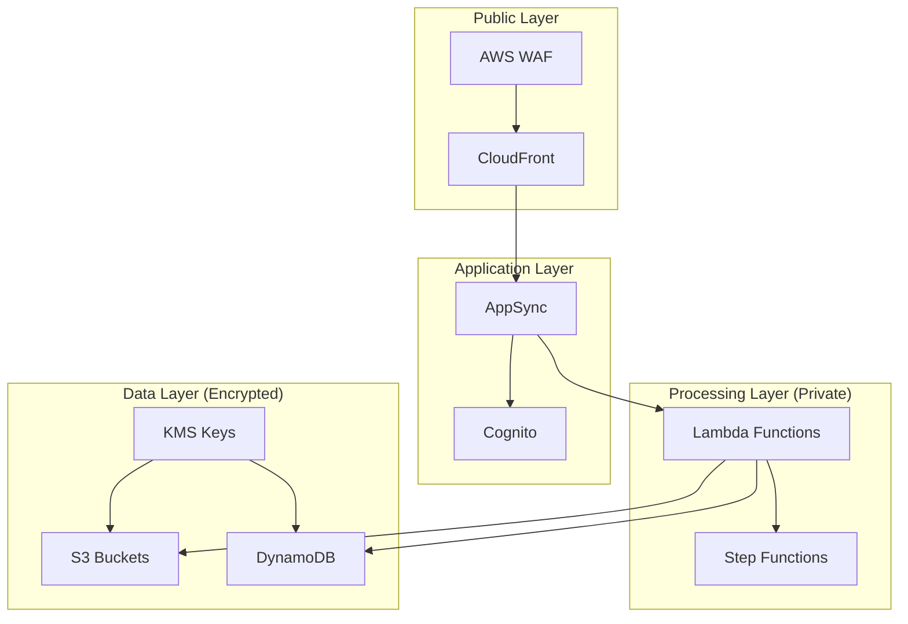
```mermaid
graph TB
    subgraph "Public Layer"
        WAF[AWS WAF]
        CF[CloudFront]
    end
    
    subgraph "Application Layer"
        APIS[AppSync]
        COG[Cognito]
    end
    
    subgraph "Processing Layer (Private)"
        LAM[Lambda Functions]
        SF[Step Functions]
    end
    
    subgraph "Data Layer (Encrypted)"
        S3[S3 Buckets]
        DDB[DynamoDB]
        KMS[KMS Keys]
    end
    
    WAF --> CF
    CF --> APIS
    APIS --> COG
    APIS --> LAM
    LAM --> SF
    LAM --> S3
    LAM --> DDB
    
    KMS --> S3
    KMS --> DDB
```

### IAM Roles and Permissions

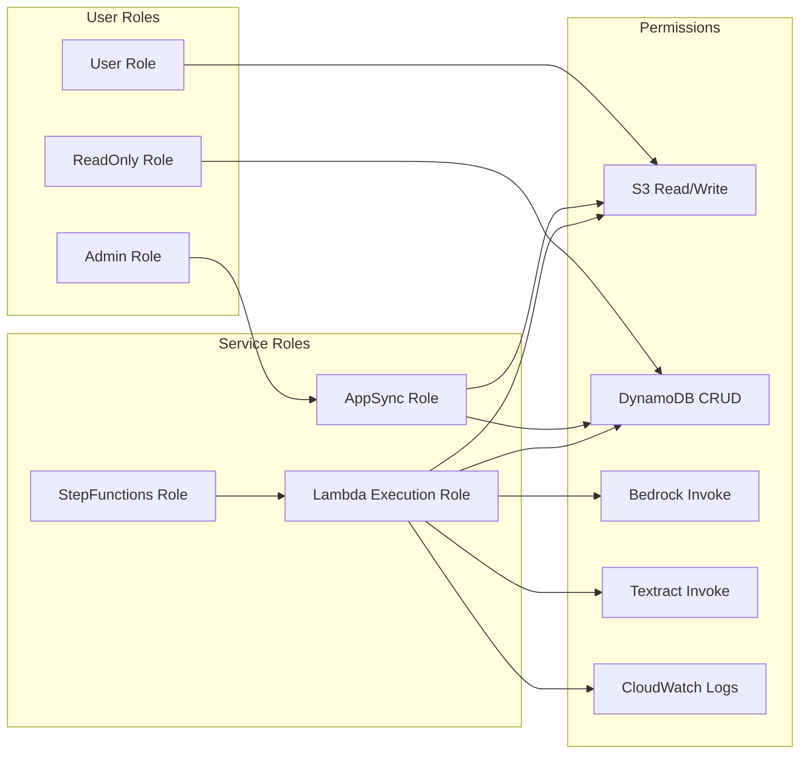
```mermaid
graph LR
    subgraph "Service Roles"
        LR[Lambda Execution Role]
        SFR[StepFunctions Role]
        ASR[AppSync Role]
    end
    
    subgraph "User Roles"
        ADM[Admin Role]
        USR[User Role]
        RO[ReadOnly Role]
    end
    
    subgraph "Permissions"
        S3P[S3 Read/Write]
        DDBP[DynamoDB CRUD]
        BRP[Bedrock Invoke]
        TXP[Textract Invoke]
        CWP[CloudWatch Logs]
    end
    
    LR --> S3P
    LR --> DDBP
    LR --> BRP
    LR --> TXP
    LR --> CWP
    
    SFR --> LR
    ASR --> DDBP
    ASR --> S3P
    
    ADM --> ASR
    USR --> S3P
    RO --> DDBP
```

## Monitoring and Observability

### Metrics Dashboard

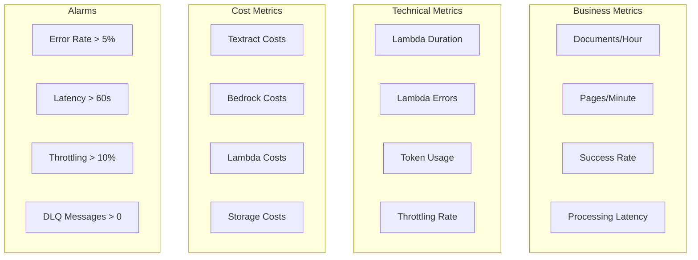
```mermaid
graph TB
    subgraph "Business Metrics"
        DPH[Documents/Hour]
        PPM[Pages/Minute]
        SR[Success Rate]
        PLT[Processing Latency]
    end
    
    subgraph "Technical Metrics"
        LMD[Lambda Duration]
        LME[Lambda Errors]
        TU[Token Usage]
        THR[Throttling Rate]
    end
    
    subgraph "Cost Metrics"
        TXT[Textract Costs]
        BRC[Bedrock Costs]
        LAM[Lambda Costs]
        STO[Storage Costs]
    end
    
    subgraph "Alarms"
        ERR[Error Rate > 5%]
        LAT[Latency > 60s]
        THR2[Throttling > 10%]
        DLQ2[DLQ Messages > 0]
    end
```

### Logging Architecture

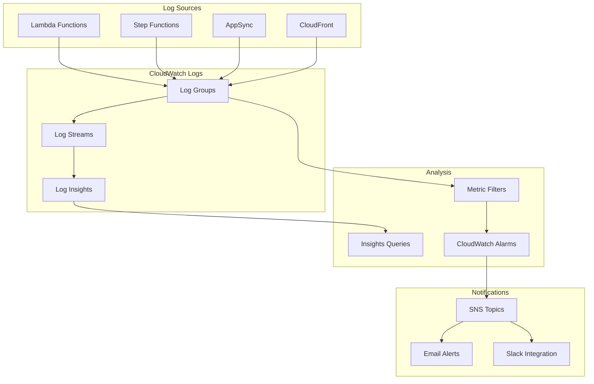
```mermaid
flowchart TD
    subgraph "Log Sources"
        LF[Lambda Functions]
        SF[Step Functions]
        AS[AppSync]
        CF[CloudFront]
    end
    
    subgraph "CloudWatch Logs"
        LG[Log Groups]
        LS[Log Streams]
        LI[Log Insights]
    end
    
    subgraph "Analysis"
        QUERY[Insights Queries]
        METRIC[Metric Filters]
        ALARM[CloudWatch Alarms]
    end
    
    subgraph "Notifications"
        SNS[SNS Topics]
        EMAIL[Email Alerts]
        SLACK[Slack Integration]
    end
    
    LF --> LG
    SF --> LG
    AS --> LG
    CF --> LG
    
    LG --> LS
    LS --> LI
    
    LI --> QUERY
    LG --> METRIC
    METRIC --> ALARM
    
    ALARM --> SNS
    SNS --> EMAIL
    SNS --> SLACK
```

## Deployment Options

### Option 1: Full Public Deployment (Standard)

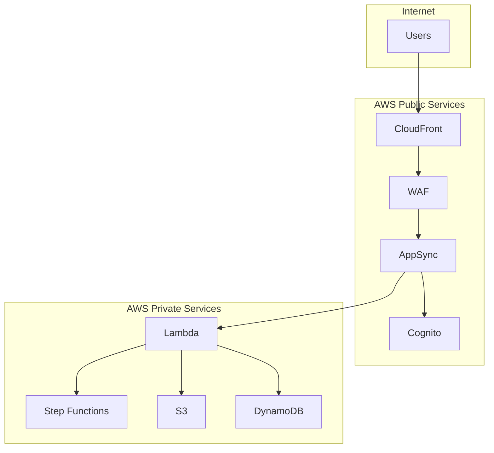
```mermaid
graph TB
    subgraph "Internet"
        USERS[Users]
    end
    
    subgraph "AWS Public Services"
        CF[CloudFront]
        WAF[WAF]
        APIS[AppSync]
        COG[Cognito]
    end
    
    subgraph "AWS Private Services"
        LAM[Lambda]
        SF[Step Functions]
        S3[S3]
        DDB[DynamoDB]
    end
    
    USERS --> CF
    CF --> WAF
    WAF --> APIS
    APIS --> COG
    APIS --> LAM
    LAM --> SF
    LAM --> S3
    LAM --> DDB
```

### Option 2: Private Deployment (No Internet-Facing Resources)

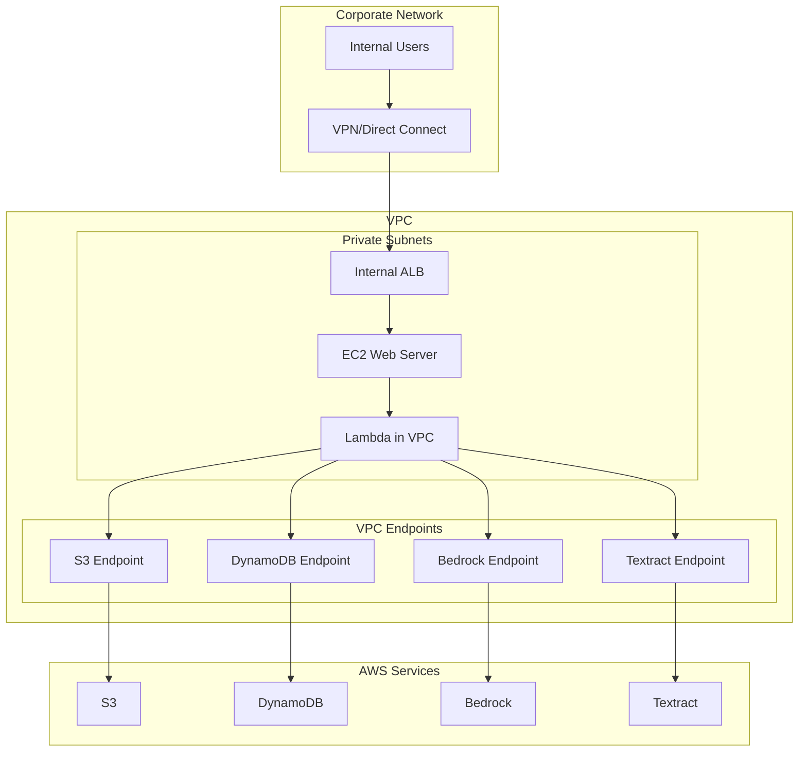
```mermaid
graph TB
    subgraph "Corporate Network"
        USERS[Internal Users]
        VPN[VPN/Direct Connect]
    end
    
    subgraph "VPC"
        subgraph "Private Subnets"
            EC2[EC2 Web Server]
            ALB[Internal ALB]
            LAM[Lambda in VPC]
        end
        
        subgraph "VPC Endpoints"
            S3E[S3 Endpoint]
            DDBE[DynamoDB Endpoint]
            BRE[Bedrock Endpoint]
            TXE[Textract Endpoint]
        end
    end
    
    subgraph "AWS Services"
        S3[S3]
        DDB[DynamoDB]
        BR[Bedrock]
        TX[Textract]
    end
    
    USERS --> VPN
    VPN --> ALB
    ALB --> EC2
    EC2 --> LAM
    
    LAM --> S3E
    LAM --> DDBE
    LAM --> BRE
    LAM --> TXE
    
    S3E --> S3
    DDBE --> DDB
    BRE --> BR
    TXE --> TX
```

### Option 3: Hybrid Deployment

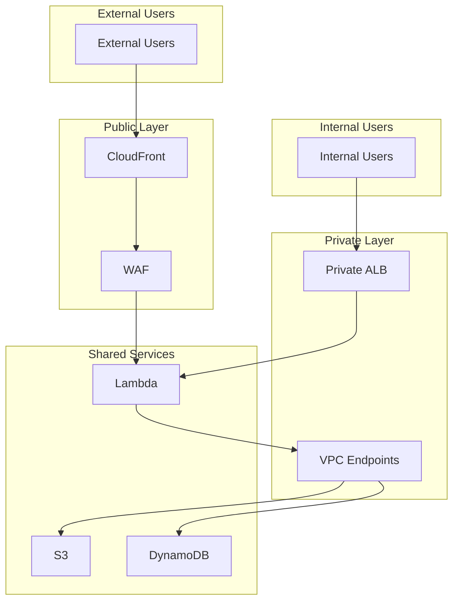
```mermaid
graph TB
    subgraph "External Users"
        EXT[External Users]
    end
    
    subgraph "Internal Users"
        INT[Internal Users]
    end
    
    subgraph "Public Layer"
        CF[CloudFront]
        WAF[WAF]
    end
    
    subgraph "Private Layer"
        VPCE[VPC Endpoints]
        PRIVALB[Private ALB]
    end
    
    subgraph "Shared Services"
        LAM[Lambda]
        S3[S3]
        DDB[DynamoDB]
    end
    
    EXT --> CF
    CF --> WAF
    WAF --> LAM
    
    INT --> PRIVALB
    PRIVALB --> LAM
    
    LAM --> VPCE
    VPCE --> S3
    VPCE --> DDB
```

## Performance Optimization

### Concurrent Processing

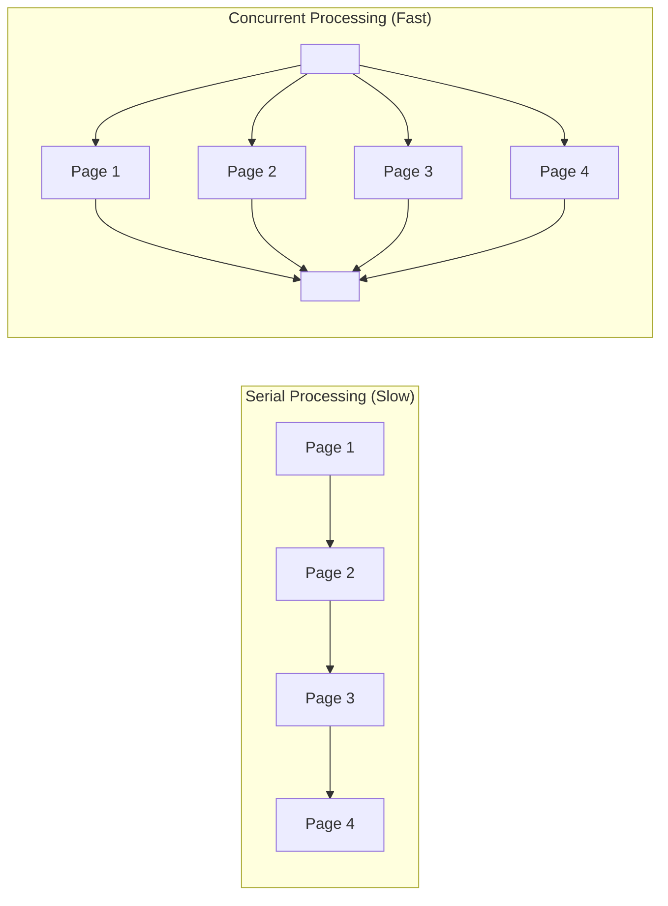
```mermaid
graph LR
    subgraph "Serial Processing (Slow)"
        P1[Page 1] --> P2[Page 2]
        P2 --> P3[Page 3]
        P3 --> P4[Page 4]
    end
    
    subgraph "Concurrent Processing (Fast)"
        START[ ] --> CP1[Page 1]
        START --> CP2[Page 2]
        START --> CP3[Page 3]
        START --> CP4[Page 4]
        CP1 --> END[ ]
        CP2 --> END
        CP3 --> END
        CP4 --> END
    end
```

### Caching Strategy

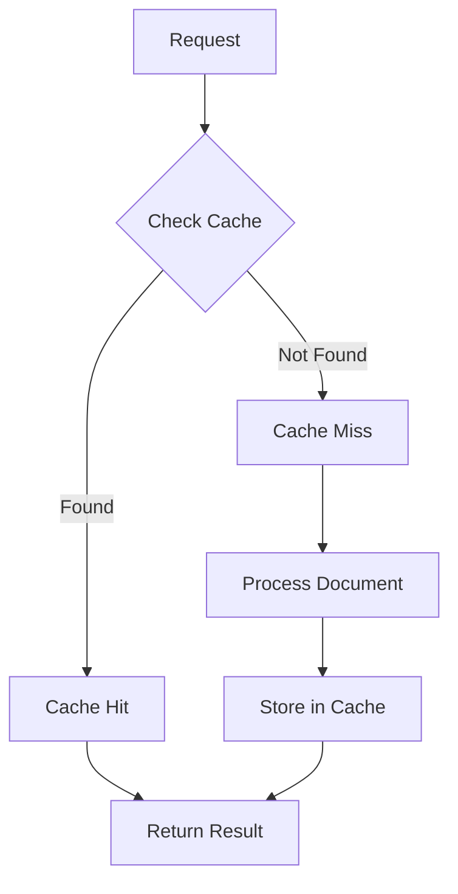
```mermaid
flowchart TD
    REQ[Request]
    CACHE{Check Cache}
    HIT[Cache Hit]
    MISS[Cache Miss]
    PROCESS[Process Document]
    STORE[Store in Cache]
    RETURN[Return Result]
    
    REQ --> CACHE
    CACHE -->|Found| HIT
    CACHE -->|Not Found| MISS
    HIT --> RETURN
    MISS --> PROCESS
    PROCESS --> STORE
    STORE --> RETURN
```

## Failure Handling

### Retry Strategy

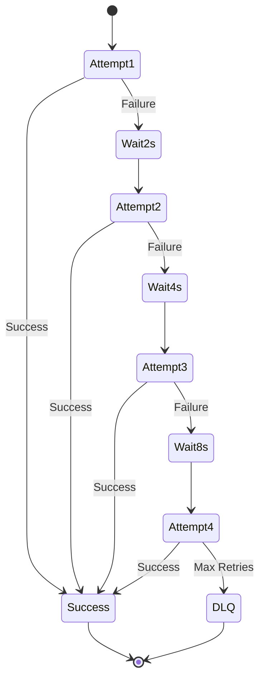
```mermaid
stateDiagram-v2
    [*] --> Attempt1
    Attempt1 --> Success: Success
    Attempt1 --> Wait2s: Failure
    
    Wait2s --> Attempt2
    Attempt2 --> Success: Success
    Attempt2 --> Wait4s: Failure
    
    Wait4s --> Attempt3
    Attempt3 --> Success: Success
    Attempt3 --> Wait8s: Failure
    
    Wait8s --> Attempt4
    Attempt4 --> Success: Success
    Attempt4 --> DLQ: Max Retries
    
    Success --> [*]
    DLQ --> [*]
```

## Summary

Pattern 2 provides a robust, scalable architecture for intelligent document processing with:

- **Flexible OCR backends** (Textract or Bedrock)
- **Advanced classification methods** (page-level or holistic)
- **Configurable extraction** with few-shot examples
- **Optional confidence assessment** for quality assurance
- **Complete UI/UX layer** for user interaction
- **Multiple deployment options** for different security requirements
- **Comprehensive monitoring** and observability
- **Built-in resilience** with retry logic and error handling

The architecture is designed to handle volumes from 100 to 1,000,000+ documents per month while maintaining high accuracy and cost efficiency.